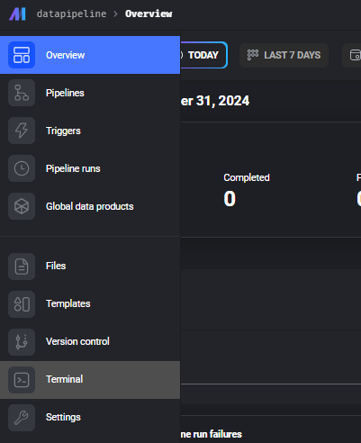
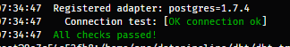

# Data-Pipeline-Architecture-with-Mage-and-DBT

## Prerequisites 

* docker
* docker compose
* github

## Installation Mage using docker and DBT

clone file installation mage using docker

```git clone https://github.com/mage-ai/mage-zoomcamp.git arhitecture_mage_dbt```

rename Enviroment file from dev.env --> .env

`mv dev.env .env`

adjust .env base on you 

and then add package that you need in pipeline to **requirement.txt** file

create profiles.yml 
with this code

``` yml
${DBT_NAME}:
  outputs:
    dev:
      dbname: ${POSTGRES_DBNAME}
      host: ${POSTGRES_HOST}
      pass: ${POSTGRES_PASSWORD}
      schema: ${POSTGRES_SCHEMA}
      port: ${POSTGRES_PORT}
      threads: 1
      type: postgres
      user: ${POSTGRES_USER}
  target: dev
```

build docker

```docker compose build ```

running docker-compose 

`docker compose up -d`  


open mage
in host `http://127.0.0.1:6789/`

open terminal in mage 



create new dbt project in mage 

```bash 
  cd $PROJECT_NAME/dbt
  dbt init -s $DBT_NAME
  cd $DBT_NAME 
  cp /root/.dbt/profiles.yml /
  dbt debug 
```

final expectation output: 

 


testing your pipeline 

- open example pipeline 
- 

Noted learning: 
- kapan kita harus pake view atau pake table 

